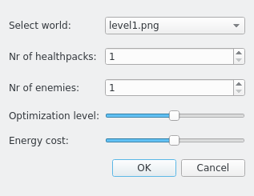
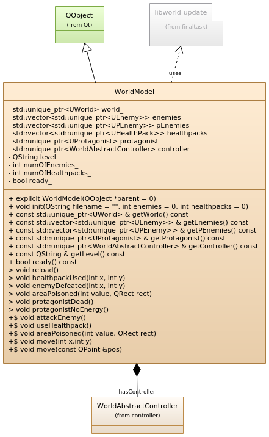

# Shoot 'Em All

## Authors

* Kasper De Volder
* Brian Segers
* Vladimir Poliakov

## Documentation

Doxygen generated documentation is available in
docs/html/index.html

## Game description

The point of the game is to defeat all enemies and stay
alive. Protagonist can only move while his energy level is higher
than zero. Protagonist will not move if the target point is
further than he can afford with energy that he has at the
moment. Every time protagonist moves according amount of energy
is being spent. Every time protagonist interact with an object,
e.g. picks up a health pack or attack the enemy, the energy level
is restored.

The hero can die because of two reasons:
* The enemy that hero has attacked is stronger than the hero's
health level
* The hero has been poisoned with a poison level bigger than
hero's health level. In that case the protagonist still has one
move to pick a health pack before he will die.

Before starting the game, player should pick the level, number
of enemies and health packs in the world, minimal energy cost of
moving through one tile and a level of
optimization for the model's controller:

Afterwards the main window will appear allowing player to move
across the world and beat enemies:

Player can switch between graphical and terminal view at any
moment by clicking `Switch view` button. Speed of animation can
also be changed using `Set animation speed` slider. Player can
change or restart the world any time by clicking `World->Load
world..` or run an AI strategy by clicking `Run strategy`. The
size of an object in the graphical representation shows the value
of that object: the bigger it is, the stronger is that enemy(or
the more HP will be restored by that health pack).

## Project description

This project is an implementation of Media Processing course's
final task. The purpose is to create a game in which the player
can mode across labyrinth and defeat enemies. The game should be
implemented with two views: graphical and terminal-like.

In graphical view, the player can move with keyboard or mouse.
Protagonist is displayed as blue circle, enemies are the red
circles, poison area of the enemy is displayed as yellow circle,
health packs are the green circles.

Protagonist path finding should be performed in shortest time
possible. For that purpose some path finding algorithm should be
introduced. Since different algorithms can be used/implemented,
application should be able to use any of them, which means that
a unified interface for path finding class should be implemented.

## Main class diagram:

Following diagram represents the model of the system divided
into packages. Each package reprsesents separate module.

`libworld` is a third party library for generating the level and
level objects: protagonist, health packs, enemies. `model`
package represents the model component of the application.
`terminalview` and `graphicsview` are view components of the
system. `controller` package represents model controller
component. Since different algorithms can be later implemented
for path finding, abstract  class `WorldAbstractController` and
factory class `WorldControllerFactory `are introduced.

## Model package

`model` package is the implementation of the model component of
the application. `model` package class diagram is shown below:

`model` package includes `WorldModel` class. `WorldModel` stores
information about the world and object that has been created
(world tiles, health packs, enemies, protagonist, level image),
as well as it provides interfaces to get information about the
model to views. Model also owns its controller, which is used
to  perform protagonist movement. View can call protagonist
movement by calling `WorldModel::move()` function.In that case,
model will call appropriate controller function to find the
shortest path to the target.

## Controller package

`controller` package includes abstract class
`WorldAbstractController`, one its successor `AStarController`,
and a factory class `WorldControllerFactory `. Following diagram
visualizes their relations:

Static method `createController()` is used by WorldModel in order
to create a controller of a certain type.In order to implement a
new controller, it should be inherited from `AbstractController`,
`findPath()` function should be implemented, and its type should
be added to `ControllerType `enumeration. For
demonstration purposes, only `AStarController` is implemented.

## Strategy package
`strategy` package implements the AI component of the application. The diagram of the package is given below:

`WorldStrategy` works on the following principle. At first,
it checks if there is an enemy in the range of motion that has
lower strength than hero's health level. If no such enemy was
found, AI looks for any health pack nearby. If no health pack was
found as well, AI signals that there is no moves left and stops.
Nevertheless, this implementation can be upgraded. If this is the
case, `nextMove()` function that defines the next
target for the protagonist, should be re-implemented by the
successor.

## Graphicsview package

`graphicsview` package  includes `WorldGraphicsView` which is
inherited from `QGraphcisView`. Following diagram shows members
and relations of `WorldGraphicsView`:

`WorldGraphicsView` class represents graphical view based on Qt's
Model-Scene-View technology. Once `setModel()` is called,
`WorldGraphicsView` draws level background and creates a
graphical item `QGraphicsEllipse` for each object with
appropriate collor, as well as it connects each graphical item to
its model object's signals, so every change in the model is
automatically impacts the view. Whenever model is reset or
reloaded, old scene is being deleted along with its graphical
items.

## Terminalview package

`terminalview` package represents the terminal view of the game.
Following diagram shows members and relations of
`WorldTerminalView`:

It has a text field for output, edit line for command input and a
button to execute the command(optionally can be done with
`Enter`). When `executeCmd()` is called, program reads the input
and splits it into actual command and arguments. If no command
was specified, help information is shown.
Along with output for user commands, `WorldTerminalView`
automatically prints information if some changes occur, e.g.
change of health level, change of protagonist position, death of
the enemy, etc.

## TODO

* [x] Modeling
  * [x] Architechture
  * [x] Model package
  * [x] Controller package
  * [x] View package
    * [x] GraphicsView
    * [x] TerminalView
  * [x] Strategy
* [x] Implementing
  * [x] Model package
  * [x] Controller package
    * [x] AbstractController
    * [x] AStarController
  * [x] View package
    * [x] GraphicsView
    * [x] TerminalView
  * [x] UI
  * [x] Strategy
