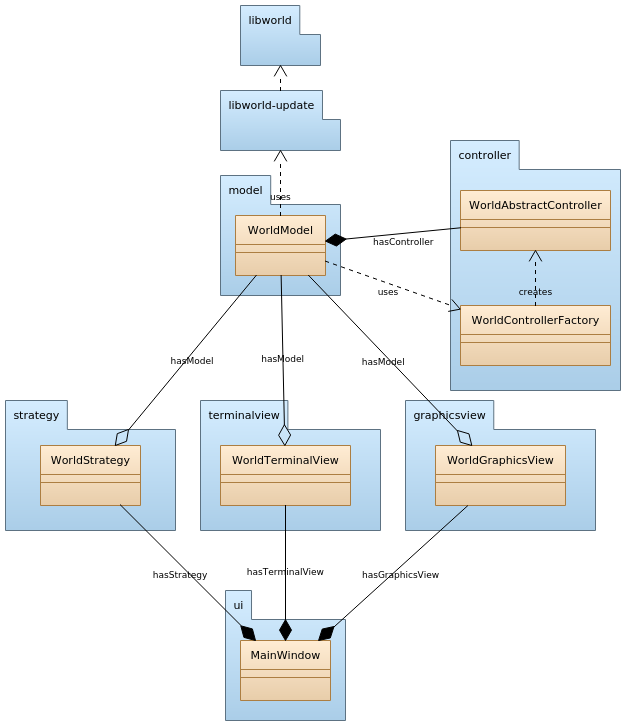

# Shoot 'Em All

## Authors

* Kasper De Volder
* Brian Segers
* Vladimir Poliakov

## Documentation

Doxygen generated documentation is available in docs/html/index.html

## Description

This project is an implementation of Media Processing course's
final task. The purpose is to create a game in which the player
can mode across labyrinth and defeat enemies. The game should be
implemented with two views: graphical and terminal-like.

In graphical view, the player can move with keyboard or mouse.
Protagonist is displayed as blue circle, enemies are the red
circles, poison area of the enemy is displayed as yellow circle,
health packs are the green circles.

Protagonist path finding should be performed in shortest time
possible. For that purpose some path finding algorithm should be
introduced. Since different algorithms can be used/implemented,
application should be able to use any of them, which means that
a unified interface for path finding class should be implemented.

## Main class diagram:

Following diagram represents the model of the system divided
into packages. Each package reprsesents separate module.

`libworld` is a third party library for generating the level and level objects: protagonist, health packs, enemies. `model` package represents the model component of the application. `terminalview` and `graphicsview` are view components of the system. `controller` package represents model controller component. Since different algorithms can be later implemented for path finding, abstract  class `WorldAbstractController` and factory class `WorldControllerFactory `are introduced.

## Model package

`model` package is the implementation of the model component of the application. `model` package class diagram is shown below:

`model` package includes `WorldModel` class. `WorldModel` stores
information about the world and object that has been created
(world tiles, health packs, enemies, protagonist, level image),
as well as it provides interfaces to get information about the
model to views. Model also owns its controller, which is used
to  perform protagonist movement. View can call protagonist
movement by calling `WorldModel::move()` function.In that case,
model will call appropriate controller function to find the
shortest path to the target.

## Controller package

`controller` package includes abstract class
`WorldAbstractController`, one its successor `AStarController`, and a factory class `WorldControllerFactory `. Following diagram visualizes their relations:

Static method `createController()` is used by WorldModel in order
to create a controller of a certain type.In order to implement a
new controller, it should be inherited from `AbstractController`,
`findPath()` function should be implemented, and its type should
be added to `ControllerType `enumeration. For
demonstration purposes, only `AStarController` is implemented.

## Graphicsview package

`graphicsview` package  includes `WorldGraphicsView` which is
inherited from `QGraphcisView`. Following diagram shows members and relations of `WorldGraphicsView`:

`WorldGraphicsView` class represents graphical view based on Qt's Model-Scene-View technology. Once `setModel()` is called, `WorldGraphicsView` draws level background and creates a graphical item `QGraphicsEllipse` for each object with appropriate collor, as well as it connects each graphical item to its model object's signals, so every change in the model is automatically impacts the view. Whenever model is reset or reloaded, old scene is being deleted along with its graphical items.

## Terminalview package

To be done

## TODO

* [ ] Modeling
  * [x] Architechture
  * [x] Model package
  * [x] Controller package
  * [x] View package
    * [x] GraphicsView
    * [ ] TerminalView
* [ ] Implementing
  * [ ] Model package
  * [ ] Controller package
    * [x] AbstractController
    * [ ] AStarController
  * [ ] View package
    * [x] GraphicsView
    * [ ] TerminalView
